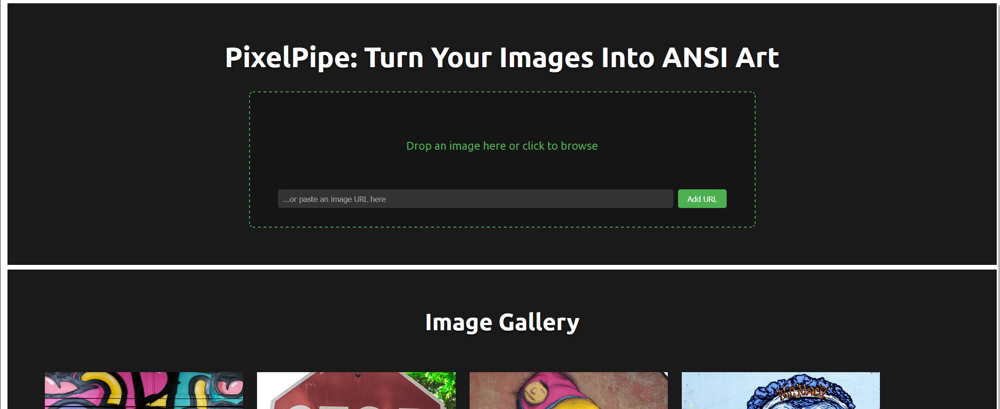
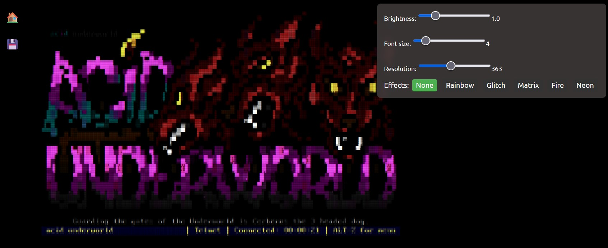
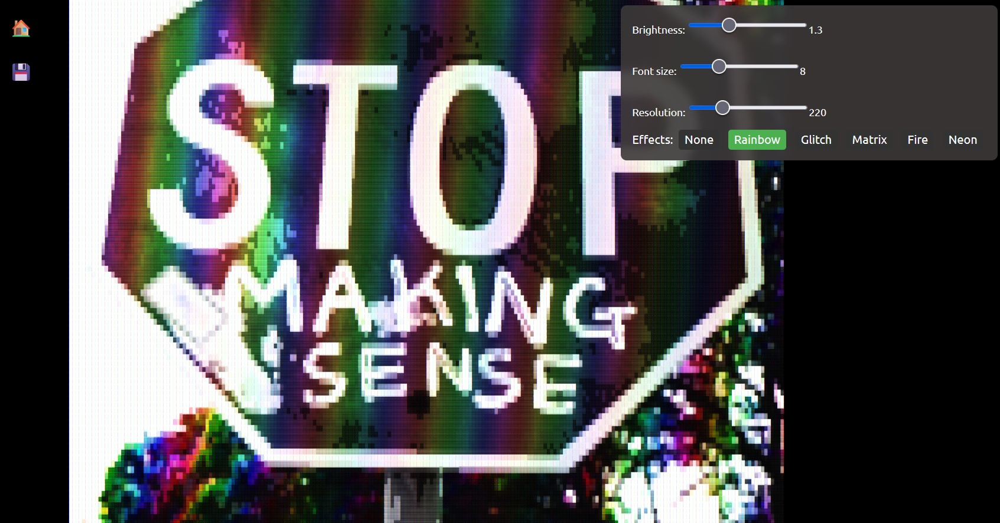

# 🎨 PixelPipe: The ANSI Art Image Portal

Welcome to **PixelPipe**, the ultimate nerdy playground for turning your favorite images into dazzling ANSI art and browsing them in style! Whether you’re a retro terminal junkie, a digital artist, or just someone who loves pixel magic, PixelPipe is here to convert, animate, and showcase your images in glorious colored text.

---

## 🖼️ Screenshots

### Main Gallery & Welcome Screen

*The main gallery interface with image browser, upload options, and quick start guide*

### ANSI Art Viewer with Effects

*Detailed ANSI art viewer with live controls for brightness, font size, resolution, and effects*

### Advanced Effect Controls

*Interactive effect controls showing the variety of visual effects available for your ANSI art*

---

## 🚀 What is PixelPipe?

PixelPipe is a web-based image browser and converter that transforms regular images (PNG, JPG, GIF, BMP) into ANSI art—those classic, colorful characters you know from old-school BBSes and terminal screens. It features:

- **Image Uploads:** Add images from your computer or the internet.
- **ANSI Conversion:** Instantly convert images to ANSI art with color and brightness control.
- **Live Preview:** See your ANSI art in a slick browser interface.
- **Visual Effects:** Apply fun effects like Rainbow, Glitch, Matrix, Fire, and Neon to your ANSI masterpieces.
- **Font & Brightness Sliders:** Tweak your art for the perfect look.
- **Gallery:** Browse all your converted and uploaded images.

---

## 🕹️ How Does It Work?

1. **Upload or Link Images:** Use the browser UI to upload images or paste URLs.
2. **Convert to ANSI:** Click on any image to convert it to ANSI art.
3. **Customize:** Adjust brightness, resolution, and font size with intuitive sliders.
4. **Apply Effects:** Choose from None, Rainbow, Glitch, Matrix, Fire, or Neon effects.
5. **Download & Share:** Save your ANSI art as .ans files for terminal viewing or HTML for web sharing!

---

## 🛠️ Tech Stack

- **Python (Flask):** Backend server for image conversion and file handling.
- **Pillow:** Image processing and manipulation.
- **JavaScript:** Interactive browser UI.
- **HTML/CSS:** Responsive and retro-inspired design.
- **ansi_up:** Converts ANSI codes to HTML for browser display.

---

## 📂 Project Structure

```
converted/      # Generated ANSI art HTML files
images/         # Source images
uploads/        # Uploaded images
scripts/        # Frontend JS (imageBrowser.js)
styles/         # CSS styles
views/          # Main HTML views
server.py       # Flask backend
image_to_ansi.py# Image conversion logic
start.py        # CLI launcher
.gitignore      # Git ignore rules
```

---

## 🧑‍💻 Getting Started

1. **Clone the repo:**
   ```
   git clone https://github.com/yourusername/pixelpipe.git
   cd pixelpipe
   ```

2. **Install dependencies:**
   ```
   pip install -r requirements.txt
   ```

3. **Run the server:**
   ```
   python server.py
   ```
   Or use the CLI launcher:
   ```
   python start.py
   ```

4. **Open your browser:**  
   Go to [http://localhost:5000](http://localhost:5000) and start converting!

---

## 🤓 Nerdy Features

- **ANSI Color Codes:** True 24-bit color for maximum retro vibes.
- **Live Controls:** Change font size and brightness on the fly.
- **Animation Packs:** Flicker, twinkle, sparkle, and more!
- **Drag-and-Drop Uploads:** Super easy image management.

---

## 🏆 Credits

- Inspired by the ANSI art scene and classic BBS culture.
- Powered by [Pillow](https://python-pillow.org/) and [ansi_up](https://github.com/drudru/ansi_up).

---

## 📜 License

MIT License. Free to use, hack, and share!

---

## 💾 Contributing

Pull requests, bug reports, and feature ideas are welcome!  
Open an issue or fork the repo and help make PixelPipe even cooler.

---

**Pipe your pixels. ANSI-fy

## 🎨 Image Credits

Demo images courtesy of:
- [Negative Space's Graffiti Collection](https://negativespace.co/collection/graffiti/) - Free for personal and commercial use
- [Pixabay Graffiti Images](https://pixabay.com/images/search/graffiti/) - Licensed under Pixabay License
- Various archival, vintage imagery - Presumed public domain due to age and expiration of applicable copyright terms
---